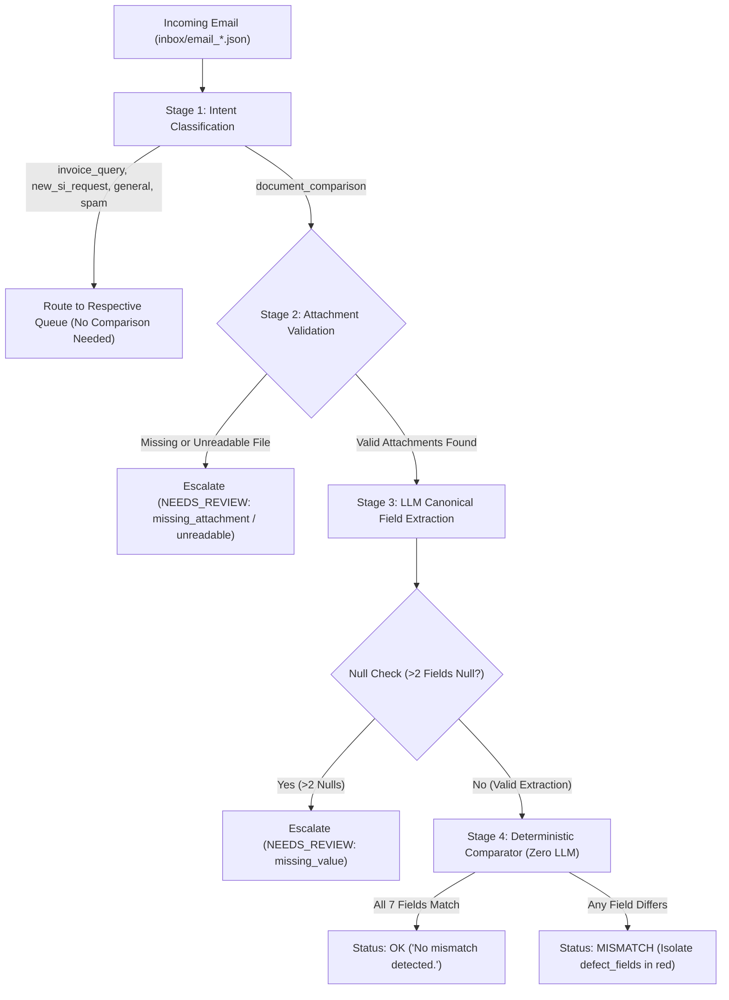

# ShipDoc AI — Shipping Document Verification System

> **Averis × Monash Hackathon 2026 Submission**  
> Automated logistics inbox triage, SI vs. BL discrepancy cross-validation, and human-in-the-loop escalation.

---

## 📌 Problem Statement

Shipping operations teams handle hundreds of mixed emails every day, including document checks, new Shipping Instruction (SI) submissions, freight invoice queries, vessel schedule updates, and spam.

Within this stream, verifying documents is one of the highest-friction tasks:
* **The "3–4x Manual Check" Bottleneck**: A single shipment's Shipping Instruction (SI) is manually cross-referenced against draft Bills of Lading (BL) **3 to 4 times per shipment** as revisions circulate between shippers, freight forwarders, and shipping lines.
* **Cost of Errors**: Even subtle mismatches in port names, consignee entities, or gross weight lead to carrier amendment penalties, customs clearance delays, or misplaced cargo at destination ports.
* **Label Variation**: SI and BL documents from different carriers rarely share identical headers (e.g., *"Port of Loading"* vs. *"Load Port"*, or *"Consignee"* vs. *"To the Order of"*), making naive string lookup unreliable.

**ShipDoc AI** solves this by classifying incoming logistics traffic, extracting the 7 canonical shipping fields into a unified schema, deterministically cross-checking values side-by-side, and immediately escalating uncertain or unreadable documents to human operators rather than guessing.

---

## 🏗️ System Architecture

The pipeline processes incoming emails through four explicit stages:



### 1. Classification (Stage 1)
- Categorizes emails into: `BL_COMPARISON`, `SI_REQUEST`, `INVOICE_QUERY`, `GENERAL`, or `SPAM`.
- Implemented with dual support: an LLM classifier (`gemini-2.5-flash` / `gpt-4o-mini`) and an auditable deterministic keyword/attachment heuristic.

### 2. Document Extraction (Stage 2)
- Pulls the **7 canonical shipment fields**:
  1. `shipper`
  2. `consignee`
  3. `notify_party`
  4. `port_of_loading`
  5. `port_of_discharge`
  6. `container_count`
  7. `gross_weight_kg`
- Normalizes disparate industry terms (e.g., *"POD"* → `port_of_discharge`, *"No. of Containers or Packages"* → `container_count`).
- Strict JSON schema enforcement with zero hallucination: unmentioned fields return `null`.

### 3. Deterministic Comparison (Stage 3 — Trust-Critical)
- **Zero LLM usage** in this phase to guarantee 100% auditable, reproducible, and explainable decisions.
- Case-insensitive, whitespace-collapsed text comparisons with country/code tolerance.
- Numeric-aware comparison for `container_count` (quantity + container type) and `gross_weight_kg` (numeric parsing with unit/comma tolerance).

### 4. Human-in-the-Loop Escalation (HITL)
- Protects operational integrity by routing low-confidence edge cases to operators:
  - `missing_attachment`: Comparison requested but files not attached.
  - `unreadable`: Binary or corrupt files that cannot be reliably parsed.
  - `missing_value`: Extractions yielding >2 missing fields.

---

## 🔬 Real Test Cases & Observed Pipeline Output

The table below reflects **actual outputs produced by running our deployed pipeline on the 520-email dataset**:

| Email ID | Predicted Category | Status | Mismatch / Escalation Details | Observed Values |
| :--- | :--- | :--- | :--- | :--- |
| **`email_001`** | `BL_COMPARISON` | `OK` | All 7 fields matched perfectly. | **Shipper**: APRIL FAR EAST (M) SDN BHD<br>**Consignee**: MOORIM SP CO., LTD<br>**POL**: PORT KLANG<br>**POD**: CALLAO, PERU<br>**Weight**: 21,577 KG |
| **`email_004`** | `BL_COMPARISON` | `MISMATCH` | Detected 2 field mismatches: `consignee`, `notify_party`. | **SI Consignee**: EAST BRIGHT FZ-LLC<br>**BL Consignee**: UAB NOVAKOPA<br>*(flagged in red for operator)* |
| **`email_002`** | `INVOICE_QUERY` | `OK` | Non-comparison email. Directly routed to billing queue. | Subject: *RE_ LOCAL CHARGES FOB - KARGOSMAR - 5AKR-61849* |
| **`email_003`** | `BL_COMPARISON` | `NEEDS_REVIEW` | Escalated: `missing_attachment` | Subject requested draft BL check, but attachments array was empty `[]`. Did not guess. |
| **`email_005`** | `BL_COMPARISON` | `NEEDS_REVIEW` | Escalated: `unreadable` | Attachments are `.xlsx` spreadsheets (`email_005_SI.xlsx`). Escalated rather than hallucinating text. |
| **`email_015`** | `SPAM` | `OK` | Filtered phishing/promotional message. | Subject: *Increase your shipping revenue with this ONE weird trick* |

### Full Dataset Verification Results (520 Emails)
```text
======================================================================
Total Emails Processed : 520
======================================================================
Category Distribution:
  - INVOICE_QUERY     : 223 (42.9%)
  - BL_COMPARISON     : 178 (34.2%)
  - SI_REQUEST        :  52 (10.0%)
  - GENERAL           :  36 ( 6.9%)
  - SPAM              :  31 ( 6.0%)

Verification Outcomes:
  - Verified Match (OK)         : 348 (66.9% across all emails)
  - Mismatches Flagged          :  74 (14.2%)
  - Escalated to Review         :  98 (18.8%)
    * missing_attachment        :  55
    * unreadable (binary docs)  :  30
    * missing_value (>2 nulls)  :  13
======================================================================
```

---

## 💻 Tech Stack

- **Language**: Python 3.10+
- **Dashboard UI**: Streamlit, Pandas
- **AI & Extraction**: Google Gemini (`gemini-2.5-flash`) / OpenAI (`gpt-4o-mini`) via structured JSON schema
- **Comparison Engine**: Auditable Python standard library (`re`, `math`, `collections`)
- **Evaluation & Ingestion**: Custom dataset loader compatible with static ZIP and Docker evaluation endpoint

---

## 🚀 How to Run Locally

### 1. Prerequisites
Ensure you have Python 3.10+ installed.

### 2. Clone & Setup Environment
```bash
# Clone the repository
git clone https://github.com/yasermusaed-eng/shipdoc-ai.git
cd shipdoc-ai

# Create and activate virtual environment
python -m venv .venv
source .venv/bin/activate    # On Windows: .venv\Scripts\activate

# Install dependencies
pip install -r requirements.txt
```

### 3. Configure API Keys (Optional for LLM features)
Copy `.env.example` to `.env`:
```bash
cp .env.example .env
```
Add your API key (if omitted, the pipeline runs in deterministic baseline mode):
```env
GEMINI_API_KEY=your_gemini_api_key_here
```

### 4. Run the Pipeline
```bash
# Run data exploration
python explore_data.py

# Process the entire inbox (saves to output/results.json)
python src/pipeline.py

# Format into official submission schema (saves to output/submission.json)
python src/format_submission.py

# Run evaluation diagnostics
python src/submit_and_score.py
```

### 5. Launch the Streamlit Demo UI
```bash
streamlit run app.py
```
Open [http://localhost:8501](http://localhost:8501) in your browser.

---

## 🌐 Live Prototype

- **Demo Video**: [Link to 5-Minute Pitch & Walkthrough](#) *(≤ 5 minutes)*
- **Interactive UI**: Run locally via `streamlit run app.py` or visit the hosted deployment at [Live Demo Link Placeholder](https://shipdoc-ai.streamlit.app).

---

## ⚠️ Known Limitations & Roadmap

Per the hackathon judging guidelines, we explicitly delineate what is functional today versus items deferred to the next release:

### What Is Working Now:
1. Complete email classification across all 5 operational categories.
2. 7-field extraction and deterministic alignment on plain-text (`.txt`) SI and BL attachments.
3. Numeric and specifier-aware comparison (detecting quantity mismatches and container spec conflicts).
4. Reliable human-in-the-loop escalation triggers for missing files and low-confidence extractions.
5. Interactive Streamlit verification table with real-time red highlighting of discrepancies.

### Known Limitations (Not Yet Implemented):
1. **Multi-Format Document Parsing (PDF / DOCX / XLSX)**:
   - 30 emails currently trigger `NEEDS_REVIEW` (`unreadable`) because attachments are binary formats.
   - *Roadmap*: Integrate `pypdf`, `openpyxl`, and `python-docx` for native tabular and document parsing.
2. **Scanned Documents & OCR**:
   - The current pipeline does not perform OCR on flattened image files or low-resolution scans.
   - *Roadmap*: Incorporate vision models (e.g., Gemini Vision) or Tesseract OCR for image attachments.
3. **Complex Body-Embedded SIs**:
   - 55 emails without attachments contain SI text pasted in the email body itself.
   - *Roadmap*: Add fallback parser to extract body-embedded cargo details when attachments are omitted.
